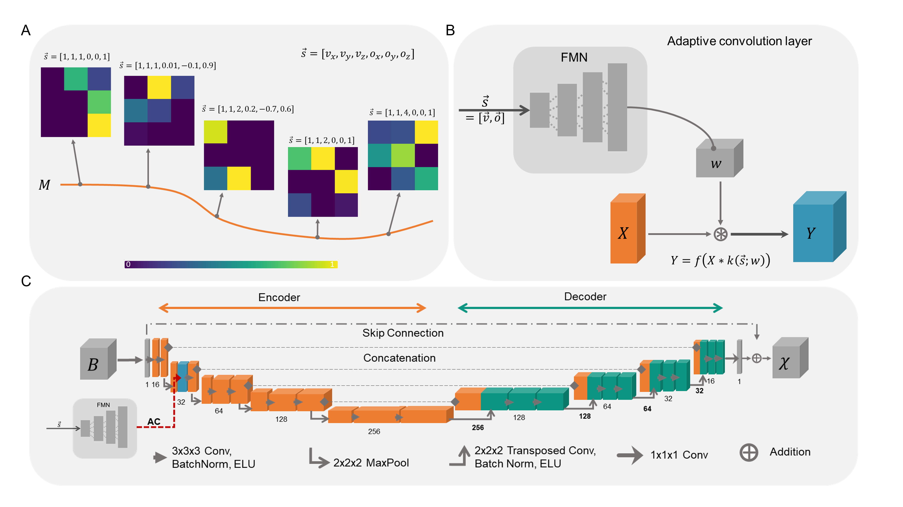

# Incorporating a-priori information in deep learning models for quantitative susceptibility mapping via adaptive convolution

This repository provides the official implementation of the Adaptive U-Net for QSM-based field-to-susceptibility inversion leveraging a-priori information.

**Paper:** [Frontiers in Neuroscience](https://doi.org/10.3389/fnins.2024.1366165     )


# Adaptive Convolution



Figure 1: Schematic overview of adaptive convolution, adaptive layers and the used 3D U-Net architecture. (A) The filter manifold compresses the relationship between the side information $\vec{s}$ and the changes in the image onto a low dimensional filter manifold in the high dimensional filter weight space. By changing the side information, the filter kernel values itself change, sweeping along the smooth filter manifold. (B) Adaptive convolutional layers are built from the Filter Manifold Network (FMN) consisting of 4 fully connected linear layers that compute the weights *w* of the respective convolution operation of the input feature maps *X*, yielding the output feature maps *Y* (blue block). (C) The 3D U-Net is composed of an encoder (orange blocks) and a decoder (turquoise blocks) with the adaptive convolution layer (dashed red arrow) included in the first encoding stage (blue block).

# Results on in vivo brain data


Figure 2: Comparison of the different network models on in vivo brain data sets with different acquisition parameters.

# Instructions 

The implementation of the Adaptive U-Net is stored here: [source code](Model/)

The model expects a 5D pytorch tensor of the image and a 1D side information tensor as input. 

```
image = torch.rand((1, 1, 320, 320, 320))
side_information = torch.Tensor((1, 1, 1, 0, 0, 1))
```

The Adaptive U-Net can be used with a residual connection to enable residual learning (as performed in the paper). Please specify the number of initial channels. The recommended default setting is 16 initial channels.

```
model = AdaptiveUNet3dELU(16, 'True') # set to 'False' to remove the residual connection
susceptiblity = model(image, side_information)
```

The output of the network model is a 5D pytorch tensor, which can be reshaped into a numpy array and stored as NIFTI image.

```
susceptiblity = susceptiblity.detach().numpy().reshape(320,320,320)
nib.save(nib.Nifti1Image(susceptibility, None), os.path.join(PATH_To_FOLDER, susceptibilit.nii.gz)) # exchange None with header and affine to attain the original orientation 
```

Include the Adaptive U-Net in your exisiting training script to newly train the model for your data. 
For further information, data or in case of problems, please contact me by e-mail at simon.graf@uk-halle.de


Please cite this paper when using the Adaptive U-Net: 

    Graf S, Wohlgemuth WA and Deistung A (2024). Incorporating a-priori information in deep learning models 
    for quantitative susceptibility mapping via adaptive convolution. Front. Neurosci. 18:1366165. doi: 10.3389/fnins.2024.1366165           
