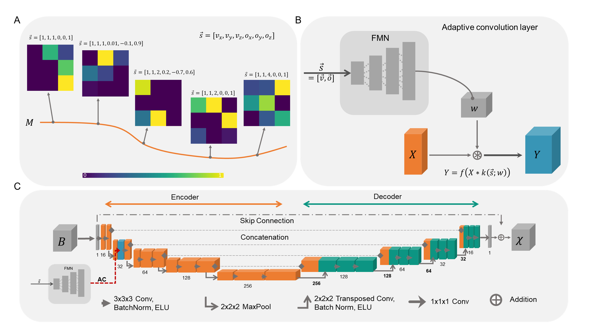

<!-- Hier Titel des Repositories eintragen -->
# Welcome to our repository of deep learning approaches for QSM!
<!-- Hier allgemeine Informationen über das Repo eingeben, zum Beispiel Autor, ... -->

   <!-- Am Ende des Abschnittes werden zwei leere Zeilen eingefügt um etwas Abstand zwischen den Unterpunkten zu generieren -->

# Projects
[Incorporating a-priori information in deep learning models for quantitative susceptibility mapping via adaptive convolution](#incorporating-a-priori-information-in-deep-learning-models-for-quantitative-susceptibility-mapping-via-adaptive-convolution)

[From Action to Anatomy - Countering Data Scarcity with Video-Based Training for Ill-Posed MRI Problems](#From Action to Anatomy - Countering Data Scarcity with Video-Based Training for Ill-Posed MRI Problems)

   <!-- Am Ende des Abschnittes werden zwei leere Zeilen eingefügt um etwas Abstand zwischen den Unterpunkten zu generieren -->

# Incorporating a-priori information in deep learning models for quantitative susceptibility mapping via adaptive convolution

<!-- Hier eine kurze Information darüber was in diesem Projekt passiert. -->

[source code (github)](AdaptiveConvolutionQSM/) | [Frontiers in Neuroscience (full paper)](https://doi.org/10.3389/fnins.2024.1366165 )

 

<!-- Bild zum Beispiel so 
 -->

 
[source code: available soon | [Machine Learning in Medical Imaging (MLMI 2025) at MICCAI2025 (full paper)](https://doi.org/10.1007/978-3-032-09513-8_12)

   <!-- Am Ende des Abschnittes werden zwei leere Zeilen eingefügt um etwas Abstand zwischen den Unterpunkten zu generieren -->
